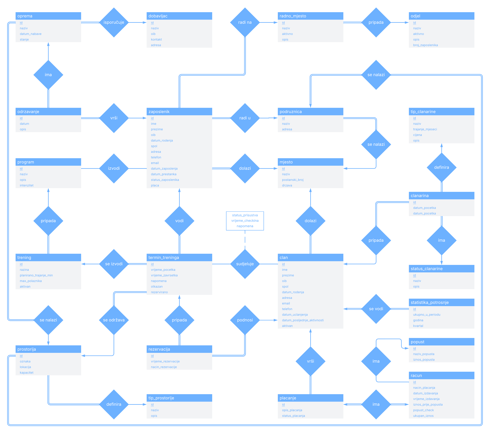

   
    

   

<h4>Sveučilište Jurja Dobrile u Puli Fakultet informatike u Puli</h4>

 

<h2>Dokumentacija projektnog zadatka  SUSTAV ZA UPRAVLJANJE FITNESS CENTROM – TIM 1</h2>

 

**O kolegiju:**
- Smjer: Informatika – online studij
- Kolegij: Baze podataka II
- Nositelj: izv. prof. dr. sc. Goran Oreški
- Asistent: dr. sc. Romeo Šajina

**Članovi:**
- Daniel Katić, voditelj + programer
- Lana Kohut, osoba za komunikaciju + programer
- Anja Svećarovski, programer
- Maja Kovačević, programer
- Mikel Milohanić, dokumentacija + programer
- Vladan Krivokapić, QA tester + programer

### SADRŽAJ

1.  [UVOD](#uvod)
2.  [OPIS POSLOVNOG PROCESA](#opis-poslovnog-procesa)
3.  [ENTITY RELATIONSHIP (ER) DIJAGRAM](#entity-relationship-er-dijagram)
4.  [VEZE ENTITETA PREMA ER DIJAGRAMU](#veze-entiteta-prema-er-dijagramu)
5.  [SHEME RELACIJSKOG MODELA](#sheme-relacijskog-modela)
6.  [EER DIJAGRAM (MySQL Workbench)](#eer-dijagram-mysql-workbench)
7.  [SQL TABLICE](#sql-tablice)
8.  [UPITI](#upiti)
9.  [POGLEDI](#pogledi)
10. [FUNKCIJE](#funkcije)
11. [PROCEDURE](#procedure)
12. [OKIDAČI](#okidači)
13. [AUTENTIFIKACIJA I AUTORIZACIJA](#autentifikacija-i-autorizacija)
14. [TRANSAKCIJE](#transakcije)
15. [ZAKLJUČAK](#zaključak)

# UVOD

&emsp;Cilj ovog projekta je izrada baze podataka u sklopu kolegija Baze podataka 2 primjenom znanja stečenog tokom semestra izvođenja kolegija. Tema samog projekta je "Sustav za upravljanje fitness centrom", a kroz bazu podataka obrađeni su dijelovi koji su važni za poslovanje jednog sustava fitness centara kao što su evidencija članova i zaposlenika, evidencija članarina i treninga, evidencija opreme, dobavljača, itd.

&emsp;Valja napomenuti kako je ova baza podataka samo studentski projekt te kao takva odstupa od baza podataka kakve se koriste u stvarnom poslovanju stoga možemo reći kako ova baza podataka obuhvaća samo neke od glavnijih dijelova s kojima se možemo susresti u poslovanju fitness centra. Kroz ovaj dokument prikazani su svi obrađeni dijelovi projekta pri čemu su neki od njih i dodatno opisani kako bi se dobio bolji dojam problema koji se rješava i cilja koji se želi postići.

&emsp;Podaci za tablice nasumično su generirani uz pomoć ChatGPT-a i samostalno izrađenih skripti u Python-u, a jedan dio podataka dobiven je pretraživanjem Wikipedije i sličnih stranica. U sljedećim poglavljima predstavit ćemo i opisati sve komponente koje smo napravili u sklopu ovog projekta, od samog poslovnog procesa i konceptualnog dijagrama, pa sve do tablica, upita, procedura itd.

# OPIS POSLOVNOG PROCESA

&emsp;Poslovni proces obuhvaćen ovom bazom podataka odnosi se na upravljanje fitness centrom koji posluje kroz više poslovnica/podružnica. Sustav omogućuje da se svi ključni podaci prate centralizirano, bez obzira na to u kojoj se podružnici određena aktivnost odvija.

&emsp;Vjerojatno najvažniji dio, bez kojeg fitness centri ne bi imali smisla, jesu članovi fitness centra. Oni se evidentiraju pomoću tablice `clan` pri čemu se bilježe podaci poput imena, prezimena, OIB-a, spola, datuma rođenja, adrese, e-mail adrese, kontakt telefona, datuma učlanjenja, datuma posljednje aktivnosti te statusa aktivnosti člana . Članovi koriste različite vrste članarina koje se definiraju u tablici `clanarina`, a svaka članarina, osim što je povezana s određenim članom, dodatno je definirana tipom i statusom koji se bilježe pomoću tablica `tip_clanarine` i `status_clanarine`, te datumom početka i datumom završetka članarine. Za svaki tip članarine dodatno se evidentira naziv, trajanje, cijena i opis, dok se za svaki status članarine definira naziv i kratki opis. Unutar tablice `statistika_potrosnje` periodično se evidentira analiza potrošnje članova po kvartalima, pri čemu se evidentira godina, kvartal i ukupan iznos unutar tog kvartala. Pri evidenciji članova koristi se i tablica `mjesto`, kojom se definira popis mjesta s nazivom, poštanskim brojem i državom, a navedena tablica koristi se i pri evidenciji zaposlenika i podružnica.

&emsp;Financijski dio baze podataka obuhvaća izdavanje računa i praćenje plaćanja tj. kada član kupi neku od članarina, u tablici `racun` pohranjuje se zapis u kojem se bilježi način plaćanja, datum i vrijeme izdavanja, iznos prije popusta, eventualni popust te ukupan iznos. Koristeći tablicu `placanje` povezuje se račune s članovima, a unutar nje bilježi se dodatni opis plaćanja i status plaćanja. Mogući popusti definirani su unutar tablice `popust` gdje su za svaki popust navedeni naziv i iznos popusta koje možemo dodjeljivati našim članovima.

&emsp;Dio baze podataka koji prati treninga realiziran je pomoću tablica program, trening, termin_treninga, rezervacija i trening_clan. Programi treninga opisani su u tablici `program` gdje se za svaki program bilježe naziv, opis i intenzitet. Na temelju programa definiraju se treninzi u tablici `trening` s informacijama o razini treninga, planiranom trajanju u minutama, maksimalnom broju polaznika te podatkom je li trening trenutno aktivan. Termini pojedinih treninga evidentiraju se u tablici `termin_treninga` pri čemu svaki termin ima definiran trening, prostoriju u kojoj se održava, trenera koji ga vodi, vrijeme početka i završetka treninga, podatak o tome je li termin otkazan te broj već podnešenih rezervacija, a dodatno se može unijeti i napomena za termin. Rezervacije članova evidentiraju se kroz tablicu `rezervacija`, gdje se bilježi član , termin treninga na koji se rezervacija odnosi, te vrijeme i način rezervacije. Stvarno prisustvo na treningu evidentira se u tablici `trening_clan` kroz status prisustva, vrijeme dolaska i eventualne napomene.

&emsp;Budući da sustav obuhvaća više poslovnica, ključnu ulogu ima tablica `podruznica` pri čemu se za svaku podružnicu definira naziv, mjesto u kojem se nalazi i adresa. Unutar svake podružnice nalaze se prostorije koje se evidentiraju u tablici `prostorija`, a za svaku prostoriju evidentirani su oznaka, lokacija i maksimalni kapacitet prostorije, podruznica, te tip prostorije preko tablice `tip_prostorije` za koji se dodatno bilježi naziv tipa i kratki opis. Navedeno omogućuje planiranje termina treninga u skladu s kapacitetom i tipom prostora u kojem se održava. Kako neke prostorije sadrže opremu, unutar tablice `oprema` prati se sva oprema smještena u pojedinim prostorijama bilježenjem podatka o nazivu opreme, datumu nabave, trenutnom stanju opreme, prostorija u kojoj se nalazi, te o dobavljaču evidentiranom unutar tablice `dobavljac` za kojeg se bilježe naziv, OIB, kontakt i adresa. Održavanje pojedine opreme evidentira se kroz tablicu `odrzavanje` gdje se bilježi koja je oprema servisirana, datum održavanja, zaposlenik koji je obavio održavanje te kratki opis samog održavanja, čime se osigurava kvaliteta usluge i sigurnost članova.

&emsp;Kako bi se rad svih poslovnica odvijao prema planu bitni su zaposlenici, njima se upravlja putem tablica `zaposlenik`, `radno_mjesto` i `odjel`. Za svakog zaposlenika prate se podaci kao što su ime, prezime, OIB, datum rođenja, spol, adresa, kontakt telefon, e-mail adresa, datum zapošljavanja i prestanka rada (ako zaposlenik više nije zaposlen), visina plaće, status zaposlenika, radno mjesto, podružnica u kojoj radi te mjesto iz kojeg dolazi. Radna mjesta grupirana su u odjele uz informacije o nazivu odjela, je li odjel aktivan, kratkom opisu odjela i ukupnom broju zaposlenih unutar tog odjela. Tablica `radno_mjesto` dodatno opisuje pojedina radna mjesta atributima naziv, aktivno i opis, te povezuje radno mjesto s odgovarajućim odjelom. Također, unutar tablice `trener_program` evidentirani su treneri s programima koje su ovlašteni voditi, na taj način sustav može kontrolirati koji trener može voditi koje programe, što se primjenjuje i u planiranju termina treninga.

&emsp;Cjelokupni poslovni proces sustava za upravljanje fitness centrom tako obuhvaća tijek od samog učlanjenja člana te definiranja i naplate članarine, preko rezervacije i pohađanja treninga, do upravljanja zaposlenicima, prostorima i inventarom. Baza podataka omogućuje transparentno praćenje svih ključnih aktivnosti i olakšava analizu poslovanja, pružajući stabilnu podlogu za daljnji razvoj usluga i optimizaciju poslovanja fitness centra.

# ENTITY RELATIONSHIP (ER) DIJAGRAM

# VEZE ENTITETA PREMA ER DIJAGRAMU

| Veza | Kardinalnost | Opis |
|:----:|:------------:|------|
| `clan` ⬅️ `clanarina`              | N:1 | • Jedan član može imati više članarina                                    • Jedna članarina pripada samo jednom članu |
| `tip_clanarine` ⬅️ `clanarina`     | N:1 | • Jedan tip članarine može definirati više članarina                      • Jedna članarina definirana je točno jednim tipom članarine |
| `status_clanarine` ⬅️ `clanarina`  | N:1 | • Jedan status članarine može biti dodijeljen na više članarina           • Jedna članarina može imati dodijeljen samo jedan status članarine |
| `clan` ⬅️ `statistika_potrosnje`   | N:1 | • Za jednog člana može se voditi više zapisa statististike potrošnje      • Jedan zapis statistike potrošnje vodi se za točno jednog člana |
| `clan` ⬅️ `placanje`               | N:1 | • Jedan član može izvšiti više plaćanja                                   • Jedno plaćanje vrši točno jedan član |
| `placanje` ↔️ `racun`              | 1:1 | • Jedno plaćanje vezuje se s jednim računom                               • Jedan račun odnosi se na točno jedno plaćanje |
| `popust` ⬅️ `racun`                | N:1 | • Jedan popust može biti dodijeljen na više računa                        • Jedan račun može imati samo jedan popust |
| `clan` ⬅️ `rezervacija`            | N:1 | • Jedan član može izvšiti više rezervacija                                • Jednu rezervaciju podnosi točno jedan član |
| `clan` ↔️ `termin_treninga`        | M:N | • Jedan član može sudjelovati na više termina treninga                    • Na jednom terminu treninga može sudjelovati više članova |
| `termin_treninga` ⬅️ `rezervacija` | N:1 | • Jedan termin treninga može imati više rezervacija                       • Jedna rezervacija se veže na točno jedan termin treninga |
| `prostorija` ⬅️ `termin_treninga`  | N:1 | • U jednoj prostoriji može se održavati više termina treninga             • Jedan termin treninga održava se u samo jednoj prostoriji |
| `tip_prostorije` ⬅️ `prostorija`   | N:1 | • Jedan tip prostorije može opisivati više prostorije                     • Jedna prostorije ima definiran točno jedan tip prostorije |
| `podružnica` ⬅️ `prostorija`       | N:1 | • U jednoj podružnici može se nalaziti više prostorija                    • Jedna prostorija nalazi se samo u jednoj podružnici |
| `prostorija` ⬅️ `oprema`           | N:1 | • U jednoj prostoriji može se nalaziti više komada opreme                 • Jedan komad opreme nalazi se u samo jednoj prostoriji |
| `trening` ⬅️ `termin_treninga`     | N:1 | • Jedan trening može se izvoditi na više različitih termina treninga      • Na jednom terminu treninga može se izvoditi samo jedan trening |
| `program` ⬅️ `trening`             | N:1 | • Jedan program može definirati više treninga                             • Jedan trening definira točno jedan program |
| `zaposlenik` ⬅️ `termin_treninga`  | N:1 | • Jedan zaposlenik/trener može voditi više različitih termina treninga    • Jedan termin treninga vodi točno jedan zaposlenik/trener |
| `zaposlenik` ↔️ `program`          | M:N | • Jedan zaposlenik može izvoditi više programa                            • Jedan program može izvoditi više zaposlenika |
| `zaposlenik` ⬅️ `odrzavanje`       | N:1 | • Jedan zaposlenik može obaviti više različitih održavanja                • Za jedno održavanje odgovoran je samo jedan zaposlenik |
| `oprema` ⬅️ `odrzavanje`           | N:1 | • Jedna oprema može imati više odrađenih održavanja                       • Jedno održavanje odnosi se na točno jedan komad opreme |
| `dobavljac` ⬅️ `oprema`            | N:1 | • Jedan dobavljač može isporučivati više različite opreme                 • Jedan artikl opreme dobavlja se od točno jednog dobavljača |
| `radno_mjesto` ⬅️ `zaposlenik`     | N:1 | • Jedno radno mjesto može imati više zaposlenika                          • Jedan zaposlenik ima jedno radno mjesto |
| `odjel` ⬅️ `radno_mjesto`          | N:1 | • Jedan odjel može imati više radnih mjesta                               • Jedno radno mjesto pripada jednom odjelu |
| `podruznica` ⬅️ `zaposlenik`       | N:1 | • Jedna podružnica može imati više zaposlenika                            • Jedan zaposlenik zaposlen je u točno jednoj podružnici |
| `mjesto` ⬅️ `zaposlenik`           | N:1 | • Iz jednog mjesta može dolaziti više zaposlenika                         • Jedan zaposlenik dolazi iz jednog mjesta |
| `mjesto` ⬅️ `podruznica`           | N:1 | • U jednom mjestu može se nalaziti više podružnica                        • Jedna podružnica nalazi se u jednom mjestu |
| `mjesto` ⬅️ `clan`                 | N:1 | • Iz jednog mjesta može dolaziti više članova                             • Jedan član dolazi iz točno jednog mjesta |

# SHEME RELACIJSKOG MODELA

| Tablica | Atributi |
|---------|----------|
| `clan`           	     | `id`, `ime`, `prezime`, `oib`, `spol`, `datum_rodenja`, `id_mjesto`, `adresa`, `email`, `telefon`, `datum_uclanjenja`, `datum_posljednje_aktivnosti`, `aktivan` |
| `clanarina`      	     | `id`, `id_clan`, `id_tip`, `id_status`, `datum_pocetka`, `datum_zavrsetka` |
| `tip_clanarine`  	     | `id`, `naziv`, `trajanje_mjeseci`, `cijena`, `opis` |
| `status_clanarine`     | `id`, `naziv`, `opis` |
| `statistika_potrosnje` | `id`, `id_clan`, `ukupno_u_periodu`, `godina`, `kvartal` |
| `mjesto`               | `id`, `naziv`, `postanski_broj`, `drzava` |
| `placanje`       	     | `id`, `id_clan`, `id_racun`, `opis_placanja`, `status_placanja` |
| `racun`          	     | `id`, `id_popusta`, `nacin_placanja`, `datum_izdavanja`, `vrijeme_izdavanja`, `iznos_prije_popusta`, `popust_check`, `ukupan_iznos` |
| `popust`         	     | `id`, `naziv_popusta`, `iznos_popusta` |
| `rezervacija`    	     | `id`, `clan_id`, `termin_treninga_id`, `vrijeme_rezervacije`, `nacin_rezervacije` |
| `trening_clan`   	     | `id`, `termin_treninga_id`, `clan_id`, `status_prisustva`, `vrijeme_checkina`, `napomena` |
| `trening`        	     | `id`, `program_id`, `razina`, `planirano_trajanje_min`, `max_polaznika`, `aktivan` |
| `mjesto`         	     | `id`, `naziv`, `postanski_broj`, `drzava` |
| `podruznica`     	     | `id`, `naziv`, `adresa`, `id_mjesto` |
| `zaposlenik`     	     | `id`, `ime`, `prezime`, `oib`, `datum_rodenja`, `spol`, `adresa`, `id_mjesto`, `telefon`, `email`, `datum_zaposlenja`, `datum_prestanka`, `status_zaposlenika`, `placa`, `id_radno_mjesto`, `id_podruznica` |
| `radno_mjesto`   	     | `id`, `naziv`, `aktivno`, `opis`, `id_odjel` |
| `odjel`          	     | `id`, `naziv`, `aktivno`, `opis`, `broj_zaposlenika` |
| `trener_program` 	     | `id`, `trener_id`, `program_id` |
| `program`        	     | `id`, `naziv`, `opis`, `intenzitet` |
| `termin_treninga`	     | `id`, `trening_id`, `prostorija_id`, `trener_id`, `vrijeme_pocetka`, `vrijeme_zavrsetka`, `napomena`, `otkazan`, `rezervirano` |
| `prostorija`     	     | `id`, `oznaka`, `lokacija`, `kapacitet`, `tip_prostorije_id`, `podruznica_id` |
| `tip_prostorije` 	     | `id`, `naziv`, `opis` |
| `oprema`         	     | `id`, `naziv`, `prostorija_id`, `dobavljac_id`, `datum_nabave`, `stanje` |
| `dobavljac`      	     | `id`, `naziv`, `oib`, `kontakt`, `adresa` |
| `odrzavanje`     	     | `id`, `oprema_id`, `zaposlenik_id`, `datum`, `opis` |

# EER DIJAGRAM (MySQL Workbench)

# SQL TABLICE

# UPITI

# POGLEDI

# FUNKCIJE

# PROCEDURE

# OKIDAČI

# AUTENTIFIKACIJA I AUTORIZACIJA

# TRANSAKCIJE

# ZAKLJUČAK

